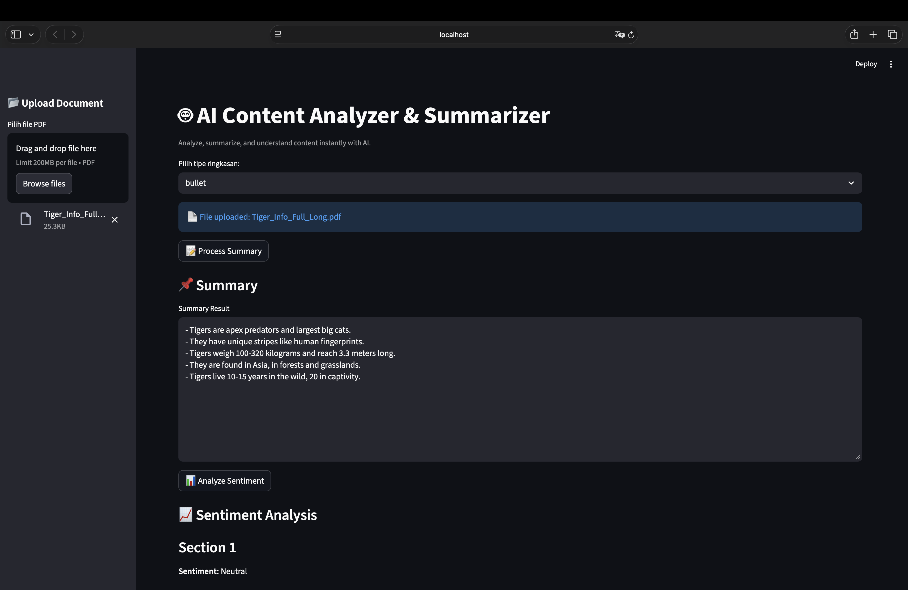
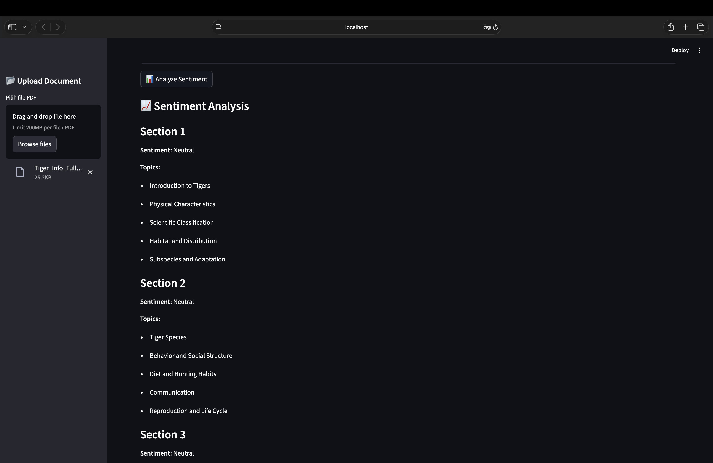

# 🤖 Doc Intelligence: AI PDF Summarizer & Sentiment/Topic Analyzer


> **Doc Intelligence** is a Streamlit application that allows you to **analyze, summarize, and understand PDF documents instantly with AI**. It features a modular pipeline for text extraction, cleaning, chunking, summarization, and sentiment/topic analysis.  



## ⚡ Key Features
- ⚡ **Flexible Summary Options**: Generate summaries in bullet, detailed, or executive style.  
- 🧹 **Smart State Management**: Automatically resets session state when switching documents to prevent “zombie data” from previous files.  
- 🔍 **Sentiment & Topic Analysis**: Analyze sentiments and extract topics from your documents.  
- 🛡️ **Secure & Clean**: Handles `.env` securely and keeps the repository free from uploaded PDF files or sensitive data.  

## 🏗️ Technical Architecture  
The system follows a **modular pipeline** designed for Streamlit's reactive execution model:  

- **Text Extraction**: PyMuPDF (`fitz`) for parsing PDF content.  
- **Text Cleaning**: Custom cleaning pipeline in `core/cleaner.py`.  
- **Chunking**: Splits large text into manageable pieces for AI processing.  
- **Summarization**: AI-powered text summarizer with multiple styles.  
- **Sentiment & Topic Analysis**: AI-driven sentiment and topic insights.  
- **Validation**: `validator.py` ensures checkpoints at each step.  
- **Frontend**: Streamlit for interactive UI.  

## 🛠️ Tech Stack  

- **AI Engine**: Groq API (for high-speed reasoning and summary generation)  
- **PDF Parsing**: PyMuPDF  
- **Orchestration**: Python modular pipeline (`core/` modules)  
- **Frontend**: Streamlit  

## ⚙️ Installation & Setup  

**Prerequisites:**  
- Python 3.10 or higher  
- A [Groq API Key](https://console.groq.com/) (Free tier available) 

1. **Clone the Repository**  
```bash
git clone https://github.com/Andri22/doc-intelligence.git
cd doc-intelligence
```

2.  **Create Virtual Environment (Optional but Recommended)**
```bash
# Windows
python -m venv venv
venv\Scripts\activate

# Mac/Linux
python3 -m venv venv
source venv/bin/activate
```

3.  **Install Dependencies**
```bash
pip install -r requirements.txt
```

4.  **Set Up Environment Keys**
Create a file named .env in the root directory and add your key(s) based on .env.example:
```bash
GROQ_API_KEY=your_actual_api_key_here
```

5.  **Run the Application**
```bash
streamlit run app.py
```
The app will automatically open in your default browser at http://localhost:8501.

## 📂 Project Structure
```markdown
doc-intelligence-app/
├── app.py                 
├── requirements.txt       
├── README.md              
├── .gitignore             
├── .env.example 
├── .env          

├── core/                   
│   ├── __init__.py
│   ├── ingest.py           
│   ├── cleaner.py          
│   ├── chunker.py          
│   ├── summarizer.py       
│   ├── analyzer.py
│   └── validator.py        

├── prompts/                
│   ├── executive.txt
│   ├── bullet.txt
│   ├── detailed.txt
│   └── sentiment_topic.txt

├── utils/
│   ├── __init__.py
│   ├── groq_client.py      
│   └── helpers.py          

├── assets/                 
└── outputs/                
    ├── 1_extracted/        
    ├── 2_cleaned/          
    ├── 3_chunks/           
    ├── 4_summaries/        
    └── 5_analysis/         
```

## 🤝 Contributing
Contributions are welcome!

📄 License
MIT License.

_Created by Andri Puji Prasetiyo_